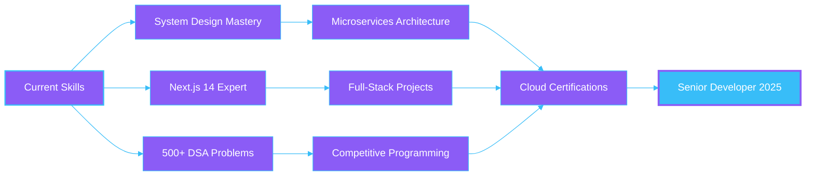

<div align="center">

<!-- Dynamic Typing Header -->
[](https://git.io/typing-svg)

<!-- Animated Header -->


<!-- Social Links with Animations -->
<p align="center">
  <a href="https://rajansportfolio.vercel.app/">
    
  </a>
  <a href="https://www.linkedin.com/in/rajanrp115/">
    
  </a>
  <a href="mailto:rajanrp115@gmail.com">
    
  </a>
  <a href="https://twitter.com/RajanRP115">
    
  </a>
  <a href="https://wa.me/919545993850">
    
  </a>
</p>

<!-- Animated Badges -->
<p align="center">
  
  
  
</p>

</div>

---

<div align="center">

## 🚀 **About Me**


</div>

```typescript
const rajan = {
    location: "Mumbai, Maharashtra 🇮🇳",
    education: "Computer Engineering Graduate 🎓",
    currentFocus: ["Next.js 14", "AI Integration", "System Design"],
    askMeAbout: ["Web Dev", "MERN Stack", "DSA", "AI"],
    technologies: {
        frontend: ["React", "Next.js", "TypeScript", "Tailwind CSS"],
        backend: ["Node.js", "Express", "MongoDB", "Firebase"],
        languages: ["JavaScript", "TypeScript", "C++", "Python"],
        tools: ["Git", "VS Code", "Postman", "Cursor AI"],
        currentlyLearning: ["System Design", "Microservices", "AWS"]
    },
    achievements: {
        problemsSolved: "200+",
        projects: "10+ Live Projects",
        rank: "Jupiter League 🏆",
        lighthouse: "100/100 ⚡"
    },
    funFact: "I debug with console.log() and I'm proud of it! 😄"
};
```

<br clear="right"/>

---

<div align="center">

## 🎯 **Highlights & Achievements**

<table>
<tr>
<td align="center" width="25%">
<br/>
<strong>200+ DSA Problems</strong><br/>
<sub>LeetCode • GFG • SoloLearn</sub>
</td>
<td align="center" width="25%">
<br/>
<strong>10+ Live Projects</strong><br/>
<sub>99.9% Uptime</sub>
</td>
<td align="center" width="25%">
<br/>
<strong>100/100 PageSpeed</strong><br/>
<sub>Lighthouse Score</sub>
</td>
<td align="center" width="25%">
<br/>
<strong>4 Certifications</strong><br/>
<sub>Professional Verified</sub>
</td>
</tr>
</table>

</div>

---

<div align="center">

## 💻 **Tech Stack & Skills**

</div>

<details open>
<summary><b>🎨 Frontend Development</b></summary>
<br/>


</details>

<details>
<summary><b>⚙️ Backend Development</b></summary>
<br/>


</details>

<details>
<summary><b>🔤 Programming Languages</b></summary>
<br/>


</details>

<details>
<summary><b>🛠️ Tools & Platforms</b></summary>
<br/>


</details>

<details>
<summary><b>🤖 AI & Modern Technologies</b></summary>
<br/>


</details>

---

<div align="center">

## 📊 **GitHub Statistics**

<table>
<tr>
<td width="50%">

### 📈 **GitHub Stats**


</td>
<td width="50%">

### 🔥 **GitHub Streak**


</td>
</tr>
</table>

### 🏆 **GitHub Trophies**


<table>
<tr>
<td width="50%">

### 📊 **Most Used Languages**


</td>
<td width="50%">

### ⚡ **WakaTime Stats**


</td>
</tr>
</table>

### 📅 **Contribution Graph**


### 🐍 **Contribution Snake**
<picture>
  <source media="(prefers-color-scheme: dark)" srcset="https://raw.githubusercontent.com/RAJAN-115/RAJAN-115/output/github-contribution-grid-snake-dark.svg">
  <source media="(prefers-color-scheme: light)" srcset="https://raw.githubusercontent.com/RAJAN-115/RAJAN-115/output/github-contribution-grid-snake.svg">
  
</picture>

</div>

---

<div align="center">

## 🚀 **Featured Projects**

<table>
<tr>
<td width="50%">

### 🤖 **AI-Powered Portfolio**
[](https://rajansportfolio.vercel.app/)
[](https://github.com/RAJAN-115/ai-portfolio-tidio-integration)

**Tech:** Next.js • TypeScript • OpenAI • Tailwind CSS

✨ Voice Navigation  
🤖 AI Chatbot Integration  
⚡ 100/100 PageSpeed Score  
🎨 Modern UI/UX Design


</td>
<td width="50%">

### 💼 **Job Application Tracker**
[](https://job-tracker-frontend-rho.vercel.app/)
[](https://github.com/RAJAN-115/job-tracker)

**Tech:** MongoDB • Express • React • Node.js

📊 Track 100+ Applications  
🔄 Real-time Updates  
📈 Analytics Dashboard  
🏛️ 99.9% Uptime


</td>
</tr>
<tr>
<td width="50%">

### 🌍 **REST Countries API**
[](https://restcountryapiapp.netlify.app/)
[](https://github.com/RAJAN-115/RestCountryAPP)

**Tech:** React • JavaScript • CSS • REST API

🔍 250+ Countries Data  
🎨 Dark/Light Themes  
⚡ <150ms Search Queries  
🌐 Responsive Design


</td>
<td width="50%">

### 📝 **More Projects**
[](https://github.com/RAJAN-115?tab=repositories)

**Explore my other projects:**

🎮 Interactive Games  
📱 Mobile-First Apps  
🎨 UI Component Libraries  
🔧 Developer Tools


</td>
</tr>
</table>

</div>

---

<div align="center">

## 🎓 **Education & Certifications**

<table>
<tr>
<td width="50%">

### 📚 **Education**

🎓 **Bachelor of Engineering (Computer)**  
📍 Parvatibai Genba Moze College  
🏛️ Savitribai Phule Pune University  
📅 2020 - 2024  
⭐ **CGPA: 7.8/10**

---

🎓 **Higher Secondary Certificate**  
📍 Utkarsha Madhyamik Vidyalaya  
📅 2019 - 2020  
⭐ **73.2%**

---

🎓 **Secondary School Certificate**  
📍 Annasaheb Vartak Smarak Vidyamandir  
📅 2017 - 2018  
⭐ **85.4%**

</td>
<td width="50%">

### 🏅 **Certifications**

📜 **Advanced C++**  
🏢 SimpliLearn | SkillUp  
📅 2023  
✅ **Certified**

---

📜 **Data Structures & Algorithms**  
🏢 YHills  
📅 2023  
✅ **Certified**

---

📜 **Web Development**  
🏢 Udemy  
📅 2023  
✅ **Certified**

---

📜 **Python Programming**  
🏢 Yonity  
📅 2023  
✅ **Certified**

</td>
</tr>
</table>

</div>

---

<div align="center">

## 🎯 **2025 Goals & Roadmap**



<table>
<tr>
<td align="center" width="25%">
<br/>
<strong>System Design</strong><br/>

</td>
<td align="center" width="25%">
<br/>
<strong>500+ DSA</strong><br/>

</td>
<td align="center" width="25%">
<br/>
<strong>Open Source</strong><br/>

</td>
<td align="center" width="25%">
<br/>
<strong>Cloud Certs</strong><br/>

</td>
</tr>
</table>

</div>

---

<div align="center">

## 🏅 **Coding Profiles & Platforms**

<table>
<tr>
<td align="center">
<a href="https://www.sololearn.com/en/profile/21555907">
<br/>
<strong>SoloLearn</strong><br/>

</a>
</td>
<td align="center">
<a href="https://auth.geeksforgeeks.org/user/rajanrp115">
<br/>
<strong>GeeksforGeeks</strong><br/>

</a>
</td>
<td align="center">
<a href="https://leetcode.com/rajanrp115/">
<br/>
<strong>LeetCode</strong><br/>

</a>
</td>
<td align="center">
<a href="https://wakatime.com/@3b47389e-3306-4fe6-b908-e8682d10c42c">
<br/>
<strong>WakaTime</strong><br/>

</a>
</td>
</tr>
</table>

</div>

---

<div align="center">

## 💡 **Random Dev Quote**


</div>

---

<div align="center">

## 🤝 **Let's Connect & Collaborate!**

<p>
<a href="https://www.linkedin.com/in/rajanrp115/">

</a>
<a href="https://rajansportfolio.vercel.app/">

</a>
<a href="mailto:rajanrp115@gmail.com">

</a>
<a href="https://twitter.com/RajanRP115">

</a>
<a href="https://wa.me/919545993850">

</a>
<a href="https://www.instagram.com/rajan__rp/">

</a>
</p>

<br/>

### 📬 **Open for:**
```yaml
opportunities:
  - Full Stack Developer Roles
  - Freelance Projects
  - Open Source Collaborations
  - Tech Consultations
  - Mentorship Programs
```

</div>

---

<div align="center">

## 🎊 **Support My Work**

<p>If you find my projects helpful, consider:</p>

<a href="https://www.buymeacoffee.com/rajanrp115">

</a>

<br/><br/>

⭐ **Star my repositories if you find them useful!**  
🔄 **Share my profile with others!**  
💡 **Contribute to my open source projects!**

</div>

---

<div align="center">

### 📊 **Detailed Profile Summary**


<table>
<tr>
<td>

</td>
<td>

</td>
</tr>
<tr>
<td>

</td>
<td>

</td>
</tr>
</table>

</div>

---

<div align="center">


### 💜 **Thanks for visiting!**

[](https://git.io/typing-svg)

<p>


</p>

**⭐️ From [RAJAN-115](https://github.com/RAJAN-115) | Happy Coding! 👨‍💻**

</div>
